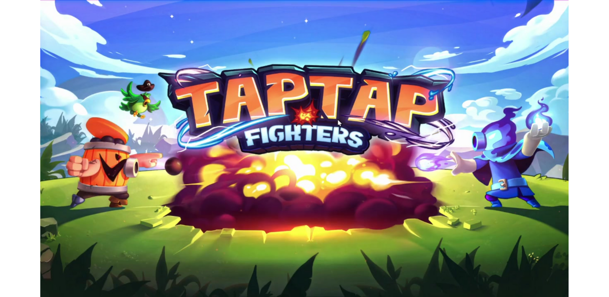

<h1>Language AI Assistant</h1>

**Project Type:** Educational Tool  
**Genre:** AI-Enhanced Language Learning  
**Development Period:** Ongoing.

## 📜 Project Summary
This innovative tool integrates Unity with AI to create an interactive English learning experience. By incorporating facial expressions and body language into a character, the project aims to make learning more engaging. The current version features a character capable of smiling and expressing anger, with plans to expand to a wider range of emotions and gestures in the future. The AI listens to the user’s speech, detects grammar mistakes, and provides corrections and explanations to improve fluency and accuracy.

## 👽 Ongoing Improvements
We are actively working to enhance the interactivity of the tool by adding a broader range of facial expressions and more nuanced body language to the AI character. This will create a richer, more immersive experience, allowing users to connect more deeply with the learning process.

## 🎮 Key Features
- **Interactive AI Character:** Character with facial expressions and body language to enhance user engagement.
- **Speech Analysis:** AI detects grammar mistakes and guides users to fix one error at a time.
- **Multi-Language Support:** Supports several languages for broader accessibility.

## 🛠️ Technologies Used
- **AI Framework:** Gemini (response generation).  
- **Text-to-Speech:** Google Text-to-Speech (voice generation).  
- **Speech-to-Text:** Speechmatics (speech transcription).  

## 👨‍💻 Role and Contributions
- **Role:**
  - Programmer.
- **Contributions:**
  - Implemented the AI systems for speech analysis and grammar correction.

## 📸 Visuals 

  <h3>Video</h3>

Special thanks to Aya Omar for her collaboration in bringing this project to life. 🌟
-------------------------
