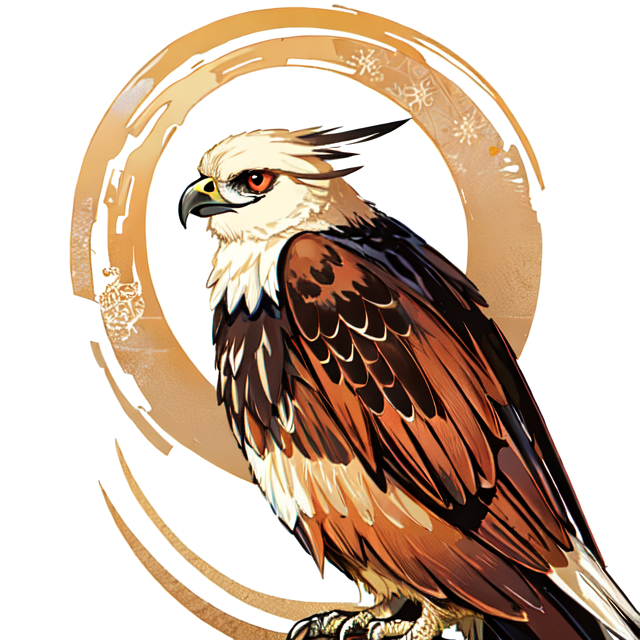
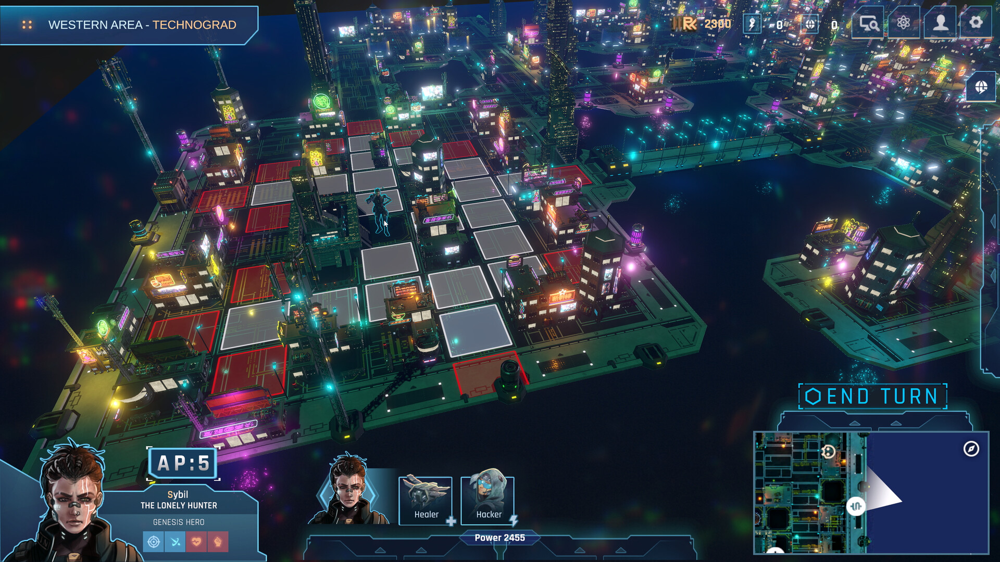
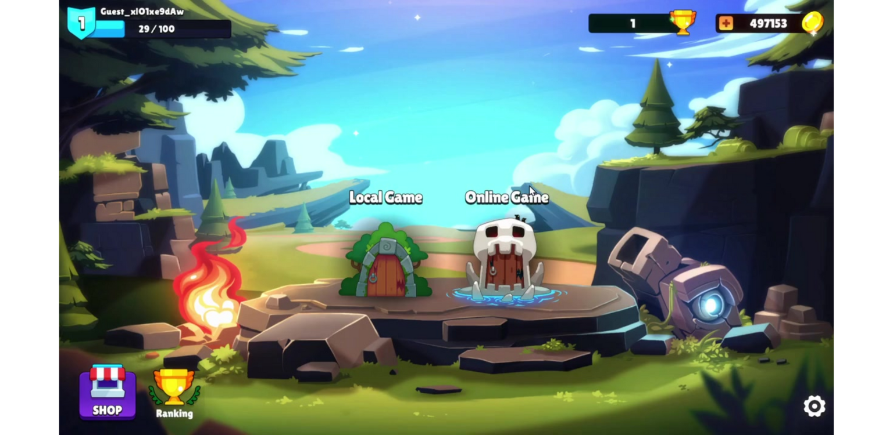
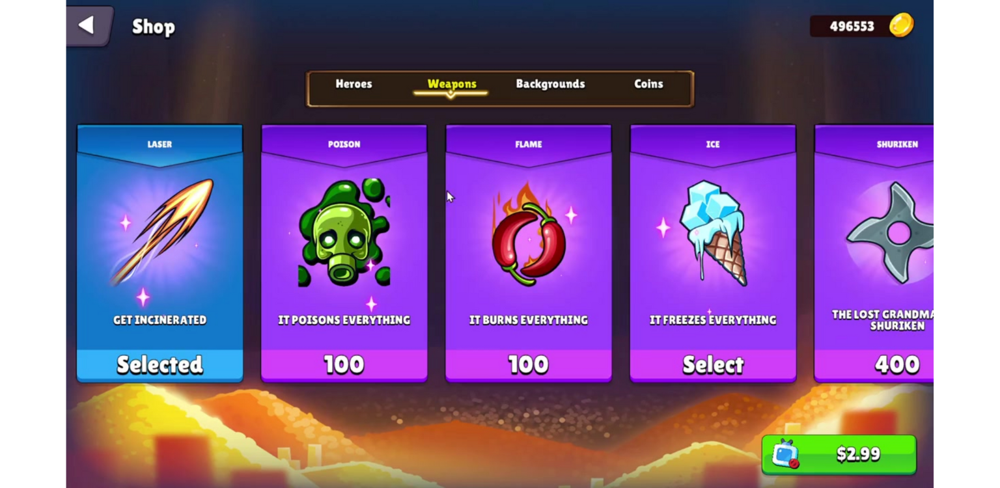
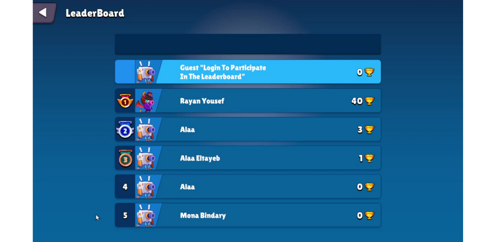

# Project Name: _[Your Game Title]_

**Project Type:** _PC/Console/Mobile/VR/AR/Web_  
**Genre:** _Action, Puzzle, RPG, Simulation, etc._  
**Development Period:** _Start Date – End Date_

## 📜 Project Summary
A short paragraph (2-3 sentences) explaining the concept, story, or gameplay mechanics.

## 🎮 Key Features
- Feature 1: _e.g., Multiplayer mode with real-time synchronization_
- Feature 2: _e.g., Procedural level generation for endless gameplay_
- Feature 3: _e.g., Customizable character skills and attributes_

## 🛠️ Technologies Used
- **Game Engine:** Unity, Unreal, Godot, etc.
- **Programming Languages:** C#, C++, etc.
- **Tools:** Photoshop, Blender, FMOD, etc.

## 🌍 Platforms Released
- Steam, iOS, Android, etc.

## 👨‍💻 Role and Contributions
- **Role:** Game Designer, Programmer, 3D Artist, etc.
- **Contributions:**  
  - Developed AI for enemy behavior.  
  - Implemented a physics-based character controller.

## 🧠 Challenges and Solutions
- **Challenge 1:** _e.g., Performance issues with large environments_  
  **Solution:** _Optimized level streaming and reduced asset load times._  
- **Challenge 2:** _e.g., Balancing complex game mechanics_  
  **Solution:** _Introduced dynamic difficulty scaling based on player stats._

## 📸 Visuals 
Tap the image to see the gameplay video!

  <h3>Video</h3>

  <h3>Screenshots</h3>

## 🔗 Download/Play Link
[Play the game here](link-to-game)

## 🏆 Awards and Recognition
- **Award 1:** _e.g., Best Indie Game at XYZ Festival_  
- **Mention 2:** _e.g., Featured in ABC Gaming Blog_

---

