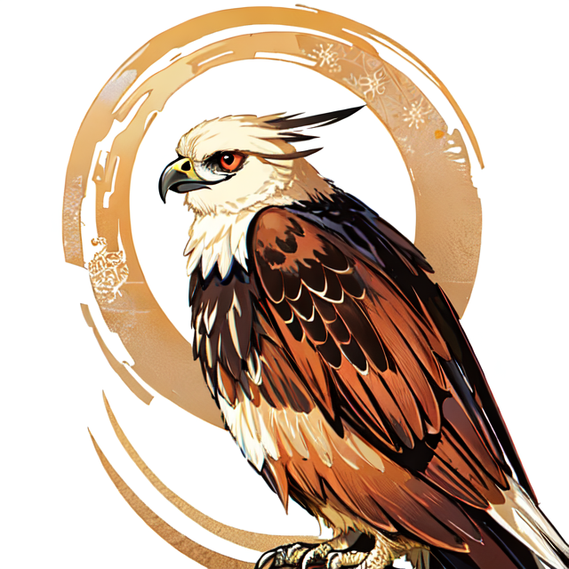

<h1>TechQuest</h1>

[Linkedin Post](https://www.linkedin.com/feed/update/urn:li:activity:7126317778608734208/?originTrackingId=l7OMgxLNQ%2BawWp4Qv7BvtA%3D%3D)

**Project Type:** PC, Web  
**Genre:** Adventure, Educational  
**Development Period:** 3 days (Hackathon Duration)

## 📜 Project Summary
This was a small, three-day project designed to integrate AI into gaming. The game uses AI to teach players through puzzles, and they are accompanied by a companion. This companion can attack and defend on command, and also assists in solving puzzles, for example, by translating English text or explaining its grammar.

## 🎮 Key Features
- **AI Companion:** Collaborate with advanced language models to progress through the narrative and solve challenges.
- **Educational Gameplay:** Seamlessly integrated puzzles and challenges designed to educate players on science and technology.
- **Diverse Exploration:** Traverse through various environments while collecting artifacts and unlocking lost technologies.

## 🛠️ Technologies Used
- **Game Engine:** Unity  
- **Programming Languages:** C#  
- **Tools:** PALM (Google LLM), Whisper (Open AI Speech To Text Model), DeepVoice AI (Text to Speech AI)

## 👨‍💻 Role and Contributions
- **Role:**
  - Game Programmer.
- **Contributions:**
  - Developed AI-driven companion mechanics using advanced language models.

## 📸 Visuals 

  <h3>Video</h3>

## 🏆 Awards and Recognition
- **First Place:** Hackathon organised by lablab.ai.  

Thank you, lablab.ai, for the opportunity, and my incredible teammates Toka Belal, Mostafa Zewail, Aya Omar, and Radwa Ahmed for making this a winning experience! 🎉
-------------------------
