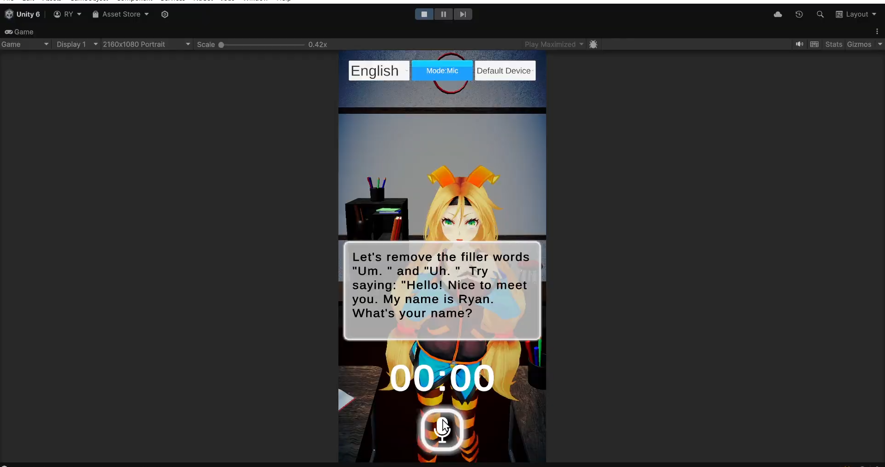

<h1>Tap Tap Fighters</h1>

**Project Type:** Mobile                                        
**Genre:** Casual  
**Development Period:** 2024

## 📜 Project Summary
It's difficult times and super powers took the world by storm. 
Many are good but some are as evil as ever. 
Choose your side and rise up the rankings to be the ultimate superhero and take control.
Tap your way through the enemy's defense to win in a heated battle

## 🎮 Key Features
- **Tap to Win**: Compete in real-time by tapping the screen as fast as possible to rack up points.
- **Power-Up Buffs**: Buffs appear randomly, giving players the chance to freeze opponents or enhance their score.
- **Leaderboard**: Compete globally and climb the leaderboard to show who’s the fastest.
- **Simple Gameplay**: Easy-to-learn mechanics ensure quick, fun sessions for all players.
- **Fast-Paced Action**: The faster you tap, the higher your score and chances of winning!

## 🛠️ Technologies Used
- **Game Engine:** Unity.
- **Programming Languages:** C#.
- **Tools:** 

  - Unity Gaming Services (UGS).
    - Relay.
    - Lobby.
    - Netcode.
  

## 🌍 Platforms Released
- iOS, Android.

## 👨‍💻 Role and Contributions
- **Role**:  
  - Game Programmer.

- **Contributions**:  
  - Developed AI systems to enhance gameplay dynamics.  
  - Integrated Unity Gaming Services, including networking with Relay, Lobby, and Netcode for real-time multiplayer functionality.  
  - Implemented interactive buffs that appear during gameplay, requiring players to click them to gain power-ups, adding an extra layer of strategy.  
  - Designed and implemented an in-game tutorial system to guide players through core mechanics and features.

## 📸 Visuals 

  <h3>Video</h3>

  <h3>Screenshots</h3>

## 🔗 Download/Play Link
[Play the game here](https://play.google.com/store/apps/details?id=com.GamesBond.TapTapFighters&hl=en)
