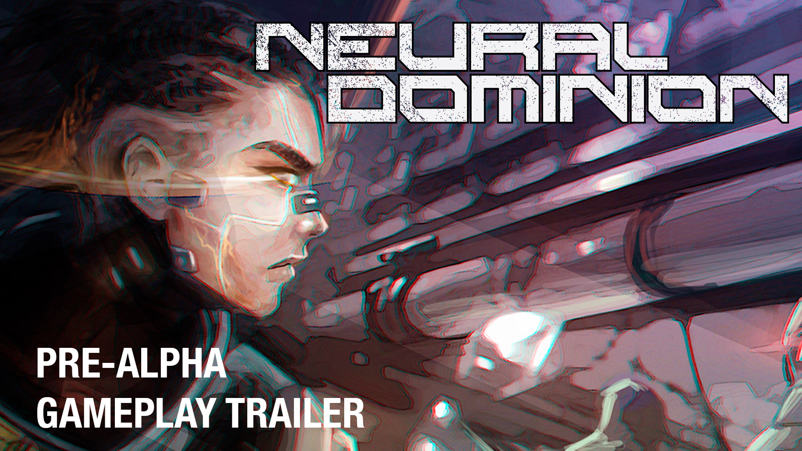

<h1>Neural Dominion</h1>

**Project Type:** _PC_  
**Genre:** 4X strategy  
**Development Period:** _2024 – Ongoing_
**Web Page:**:[Steam](https://store.steampowered.com/app/2493210/Neural_Dominion/).

## 📜 Project Summary
Neural Dominion is a cyberpunk 4X strategy game where players control gangs in a neon-lit city. Engage in crime, manage resources, and use cybernetic enhancements to outsmart opponents in a blend of turn-based and real-time combat. The game combines city management, research, and tactical warfare in a gritty, high-tech world.
[Game Article](https://www.pcgamesn.com/neural-dominion/cyberpunk-4x-strategy-game).

## 🎮 Key Features
- **Gang Control**: Manage one of five unique cyberpunk gangs, each with different strengths.
- **Resource Management**: Balance crime, economy, and technology to expand influence.
- **Tactical Combat**: Combine turn-based and real-time mechanics for dynamic battles.
- **Cybernetic Enhancements**: Upgrade gang members with advanced cyberware to gain combat advantages.
- **City Domination**: Strategically control districts, exploit local resources, and build your empire.

## 🛠️ Technologies Used
- **Game Engine:** Unity.
- **Programming Languages:** C#.

## 🌍 Platforms Released
- Steam.

## 👨‍💻 Role and Contributions
- **Role:** Game Programmer.
- **Contributions:**  
  - Developed major game systems from scratch, including Combat, Inventory, Stat, Skill, Store, AI, Audio, Character, Minimap, and Tutorial systems.
  - Contributed to the project’s base architecture, optimizing performance and scalability.
  - Worked on refining and enhancing existing systems, ensuring smooth integration across gameplay mechanics.

## 📸 Visuals 

  <h3>Video</h3>

  <h3>Screenshots</h3>

